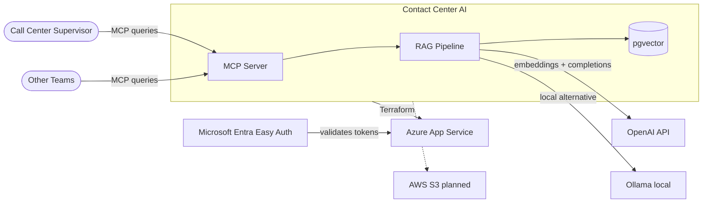
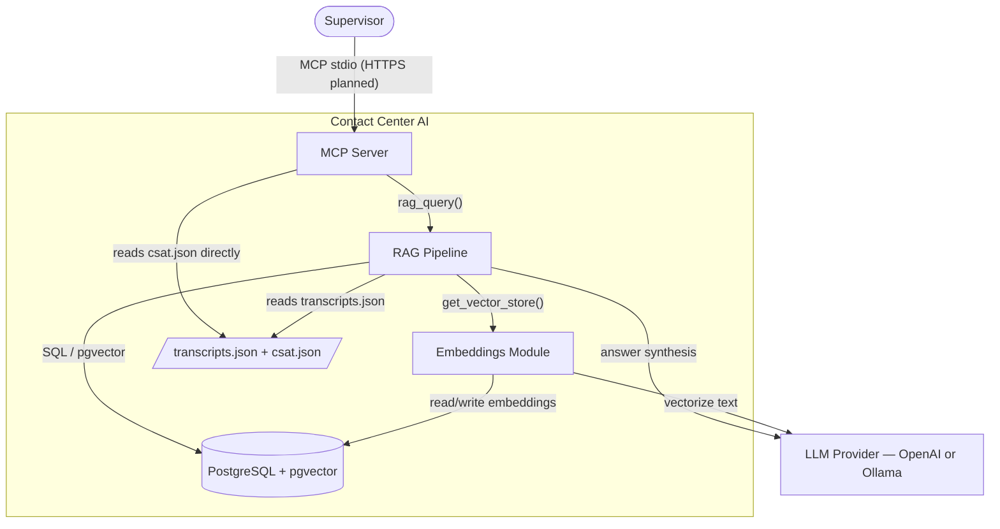
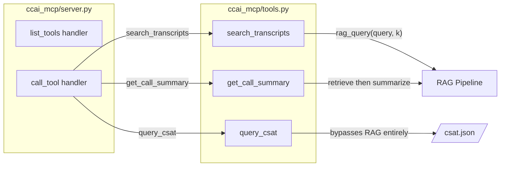
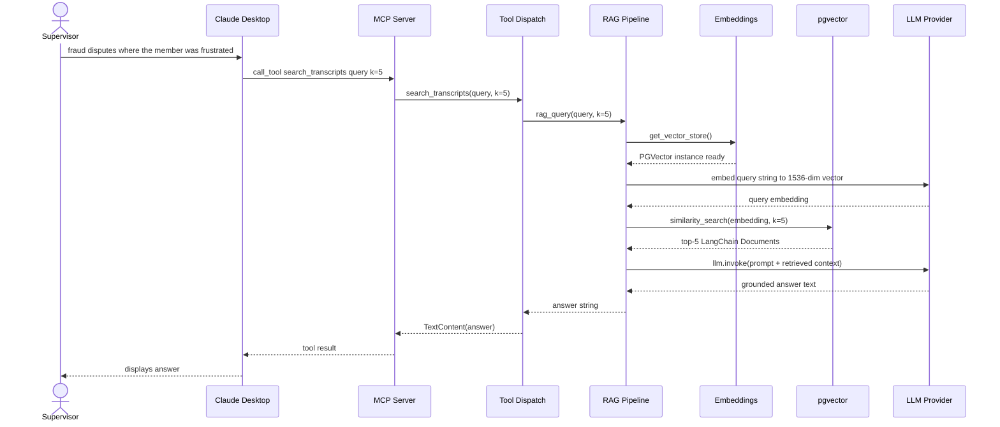
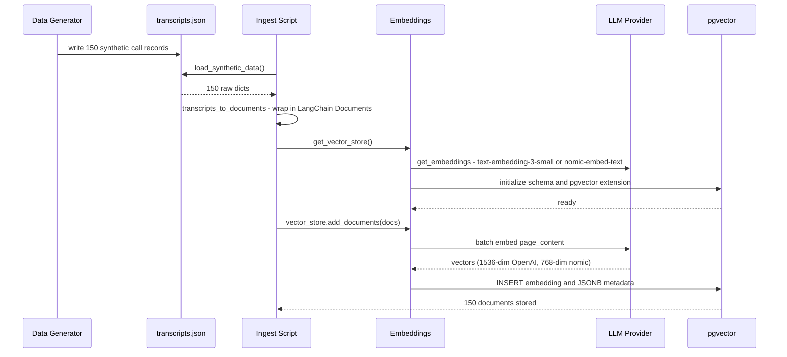

There's a question that haunts every call center manager: "What's actually going on out there?"

The data exists. Hundreds of call transcripts, recorded and transcribed every week. CSAT surveys from members who bothered to respond. Agent notes. Outcome codes. But turning that pile of raw data into an answer to "what are members saying on fraud dispute calls that go badly?" requires someone to actually dig through it — manually. Keyword searching, listening to recordings, building mental models across dozens of calls. It's slow, it misses context, and it doesn't scale.

This series is about building a system that makes that question answerable in seconds, using natural language, with the pieces a real deployment needs: a shared service boundary, swappable LLM providers, and infrastructure as code.

---

## The Context

The system documented in this series grew out of a consulting engagement with a financial institution — let's call them Northgate Federal Credit Union, a name I've invented. They had a problem familiar to any enterprise mid-AI-adoption: multiple teams independently using Claude, OpenAI, and Gemini, no shared infrastructure, and no way to reuse the work across teams.

Several teams were independently building AI features against the same call and survey data, each heading toward its own pipeline to it.

The design constraint that shaped everything: **build one thing that all of them can use.** That meant the core retrieval and data access layer needed to be a shared service, not a team-specific application. MCP — the Model Context Protocol — turned out to be the right abstraction for that.

This repo (and this series) uses fully synthetic data. No real member information, no real call recordings, no PII. The architecture decisions are real. The code is real. The numbers are fake.

The code behind this series was built between April and June 2026. The first four write-ups were published together once it was working.

---

## What We're Building

At its core, this is a **RAG pipeline** (Retrieval-Augmented Generation) surfaced through an **MCP server**. Call transcripts are embedded into a vector database. When a supervisor asks a natural language question, the system finds the most semantically relevant transcripts, constructs a context window, and lets an LLM synthesize an answer grounded in the actual call data.

The MCP server exposes three tools:

- **`search_transcripts`** — semantic search across call transcripts; returns an AI-generated answer grounded in the top-k most relevant calls
- **`get_call_summary`** — retrieve and summarize a specific call by ID
- **`query_csat`** — filter and aggregate CSAT survey data by score range and call category

Any MCP-compatible client — Claude Desktop, a custom web UI, or another team's internal tool — can call these tools without knowing anything about the underlying retrieval machinery.

---

## The Architecture

### System Context

The outermost view shows the actors and systems this solution touches.



*Figure 1 — System context. Two details are worth noting: Entra authentication is handled entirely at the infrastructure layer (the Python application contains zero auth code), and the Ollama path is a drop-in swap controlled by a single environment variable.*

---

### Containers

Zooming in, there are three containers: one Python process (the MCP server, which runs the RAG pipeline and embeddings module in-process), PostgreSQL with pgvector, and the JSON data files, plus the external LLM provider. The diagram also draws the pipeline and embeddings module as separate boxes because the component boundary matters more than the process boundary for what follows.



*Figure 2 — Container view. The split between `search_transcripts`/`get_call_summary` (which go through the full RAG stack) and `query_csat` (which reads JSON directly) is a deliberate design choice — CSAT data is structured and small enough that vector search adds no value.*

---

### Components — The MCP Tool Layer

The MCP server is a single Python process. `server.py` is the async entry point; `tools.py` is where the actual work happens.



*Figure 3 — The tool dispatch layer. `query_csat` is the outlier: it's the only tool that doesn't go through the vector store or the LLM. It's just a JSON file and some Python filtering logic.*

---

## The Flows

Architecture diagrams show structure. Sequence diagrams show what actually happens when a request comes in.

### Flow 1 — A Single MCP Query

When a supervisor types "fraud disputes where the member was frustrated" into Claude Desktop, here's the full path:



*Figure 4 — MCP query flow. The round-trip involves two model calls: one embedding call to vectorize the query (fast, cheap) and one chat completion to synthesize the answer (slower, more expensive). Both happen over the same provider — swap the `LLM_PROVIDER` env var and both switch simultaneously.*

---

### Flow 2 — Ingest and Embedding

Before any query can work, the transcripts need to be in the vector store. This is the ingestion flow:



*Figure 5 — Ingest flow. One thing to note: there's no deduplication guard. Running `--ingest` twice creates duplicate rows. Fine for a portfolio project; a production deployment would need upsert logic or an idempotency check before calling `add_documents()`.*

---

## What's Coming

This first post covered the architecture at a high level. The next eight posts build the system layer by layer:

| Post | Title | What gets built |
|---|---|---|
| 02 | [From Text to Vectors](/posts/from-text-to-vectors/) | Deep dive on the data pipeline: synthetic generation, embeddings, pgvector setup, LangChain abstractions |
| 03 | [The Interface Layer](/posts/the-interface-layer/) | MCP internals: tool schemas, the stdio transport, connecting Claude Desktop, reusability across teams |
| 04 | [Run Anywhere](/posts/run-anywhere/) | Swapping LLM providers via `LLM_PROVIDER`; running entirely local with Ollama; cost and privacy trade-offs |
| 05 | Built to Last (planned) | Infrastructure as code: Terraform/OpenTofu on Azure, App Service, Entra Easy Auth pattern |
| 06 | What Should We Measure? (planned) | LLM and RAG observability design: what metrics matter, what Grafana and OpenTelemetry bring |
| 07 | Wiring It Up (planned) | Implementing observability: OTel instrumentation, docker-compose additions, live Grafana dashboards |
| 08 | Trust, but Verify (planned) | Detecting RAG degradation: embedding drift, retrieval quality signals, CSAT as ground truth, SLOs |
| 09 | What's Next (planned) | The emerging landscape: Coding agents, LangGraph, Azure AI Foundry — and how this MCP-first approach stays durable |

---

## Try It Yourself

The full code is at [github.com/HendoCode/contact-center-ai](https://github.com/HendoCode/contact-center-ai). Here's the quickstart:

```bash
# 1. Start the local infrastructure
docker compose up -d

# 2. Create a virtualenv and install dependencies (uses uv)
uv venv --python 3.12
uv sync --extra dev

# 3. Configure your environment
cp .env.example .env
# Edit .env: set OPENAI_API_KEY (or set LLM_PROVIDER=ollama for no API key)

# 4. Generate synthetic data
uv run python data/synthetic/generate_data.py

# 4a. Optional: drop any previously ingested data (run this if you've ingested before)
uv run python -m rag.pipeline --reset

# 5. Embed and store in pgvector
uv run python -m rag.pipeline --ingest

# 6. Test a query end-to-end
uv run python -m rag.pipeline --query "fraud disputes where the member was frustrated"

# 7. Start the MCP server (normally Claude Desktop starts this for you; see Post 3)
uv run python -m ccai_mcp.server
```

Post 2 goes much deeper on what each of these steps actually does — the data structures, the LangChain abstractions, the SQL that pgvector generates under the hood.